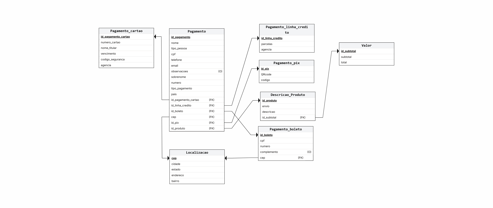

# Atividade de 3 - Banco de Dados
## Grupo: 
- Miguel Rodrigues Spínola da Hora;
- Raquel Martiniano Felix Pires;
- Gustavo Dias de Lima;
- Arthur dos Santos Fontenele;

## Objetivo:
- Criar comandos sql do site **ORQUIDÁRIO MATSUOKA** utilizando como base o diagrama relacional e o dicionário de dados feitos anteriormente pela equipe.

## Diagrama Relacional:

## Dicionário de Dados:

**Tabela:** Pagamento

| Colunas | Descrição | Tipo de Dado | Tamanho | Null | PK | FK | Unique | Identity | Default | Optional | 
| ------- | --------- | ------------ | ------- | ---- | -- | -- | ------ | -------- | ------- | ------- |
| id_pagamento | chave do pagamento | INT |  | &#9744;  | &#9745; | &#9744; | &#9744; | &#9745; |  | &#9744; |
| nome | nome do cliente | VARCHAR | 255 | &#9744;  | &#9744; | &#9744; | &#9744; | &#9744; |  | &#9744; |
| tipo_pessoa | pessoa jurídica ou física | VARCHAR | 50 | &#9744;  | &#9744; | &#9744; | &#9744; | &#9744; |  | &#9744; | 
| cpf | cpf do cliente | VARCHAR | 15 | &#9744;  | &#9744; | &#9744; | &#9744; | &#9744; |  | &#9744; |
| telefone | telefone do cliente | VARCHAR | 20 | &#9745;  | &#9744; | &#9744; | &#9744; | &#9744; |  | &#9744; | 
| email | email do cliente | VARCHAR | 255 | &#9744;  | &#9744; | &#9744; | &#9744; | &#9744; |  | &#9744; |
| observacoes | detalhamento do pagamento | VARCHAR | 255 | &#9744;  | &#9744; | &#9744; | &#9744; | &#9744; |  | &#9745; |
| sobrenome | segundo nome do cliente | VARCHAR | 255 | &#9744;  | &#9744; | &#9744; | &#9744; | &#9744; |  | &#9744; |
| numero | numero do cartão | VARCHAR | 20 | &#9744;  | &#9744; | &#9744; | &#9744; | &#9744; |  | &#9744; |
| tipo_pagamento | tipo do pagamento da compra | VARCHAR | 50 | &#9744;  | &#9744; | &#9744; | &#9744; | &#9744; |  | &#9744; |
| pais | nome do país | VARCHAR | 255 | &#9744;  | &#9744; | &#9744; | &#9744; | &#9744; |  | &#9744; |
| id_pagamento_cartao | cartão do pagamento | INT |  | &#9744;  | &#9744; | &#9745; | &#9744; | &#9744; |  | &#9744; |
| id_pix | identificador do pagamento pix | INT |  | &#9744;  | &#9744; | &#9745; | &#9744; | &#9744; |  | &#9744; |
| produto | identificação dos produtos | INT |  | &#9744;  | &#9744; | &#9745; | &#9744; | &#9744; |  | &#9744; |
| id_linha_credito | identificação do pagamento em crédito | INT |  | &#9744;  | &#9744; | &#9745; | &#9744; | &#9744; |  | &#9744; |
| id_boleto | identificação do pagamento em boleto | INT |  | &#9744;  | &#9744; | &#9745; | &#9744; | &#9744; |  | &#9744; |
| id_endereco | cep do endereço | VARCHAR | 10 | &#9744;  | &#9744; | &#9745; | &#9744; | &#9744; |  | &#9744; |

**Tabela:** Localizacao

| Colunas | Descrição | Tipo de Dado | Tamanho | Null | PK | FK | Unique | Identity | Default | Optional |
| ------- | --------- | ------------ | ------- | ---- | -- | -- | ------ | -------- | ------- | ------- |
| cep | cep do endereço | VARCHAR | 10 | &#9744;  | &#9745; | &#9744; | &#9744; | &#9744; |  | &#9744; |
| cidade | cidade do cliente | VARCHAR | 255 | &#9744;  | &#9744; | &#9744; | &#9744; | &#9744; |  | &#9744; |
| estado | estado do cliente | VARCHAR | 255 | &#9744;  | &#9744; | &#9744; | &#9744; | &#9744; |  | &#9744; |
| endereco | nome da rua | VARCHAR | 255 | &#9744;  | &#9744; | &#9744; | &#9744; | &#9744; |  | &#9744; |  
| bairro | nome do bairro | VARCHAR | 255 | &#9745;  | &#9744; | &#9744; | &#9744; | &#9744; |  | &#9744; | 

**Tabela:** Pagamento_boleto

| Colunas | Descrição | Tipo de Dado | Tamanho | Null | PK | FK | Unique | Identity | Default | Optional |
| ------- | --------- | ------------ | ------- | ---- | -- | -- | ------ | -------- | ------- | ------- |
| id_boleto | identificação da forma de pagamento boleto | INT |  | &#9744;  | &#9745; | &#9744; | &#9744; | &#9745; |  | &#9744; |
| cpf | cpf do cliente | VARCHAR | 15 | &#9744;  | &#9744; | &#9744; | &#9744; | &#9744; |  | &#9744; |
| numero | numero do cartão do cliente | VARCHAR | 16 | &#9744;  | &#9744; | &#9744; | &#9744; | &#9744; |  | &#9744; |  
| complemento | informações adicionais do boleto | VARCHAR | 255 | &#9744;  | &#9744; | &#9744; | &#9744; | &#9744; |  | &#9745; |
| cep | cep do endereço | VARCHAR | 10 | &#9744;  | &#9744; | &#9745; | &#9744; | &#9744; |  | &#9744; |

**Tabela:** Pagamento_linha_credito

| Colunas | Descrição | Tipo de Dado | Tamanho | Null | PK | FK | Unique | Identity | Default | Optional |
| ------- | --------- | ------------ | ------- | ---- | -- | -- | ------ | -------- | ------- | ------- |
| id_linha_credito | identificação da forma de pagamento linha de crédito | INT |  | &#9744;  | &#9745; | &#9744; | &#9744; | &#9745; |  | &#9744; |
| parcelas | quantidade de parcelas cobradas | INT |  | &#9744;  | &#9744; | &#9744; | &#9744; | &#9744; |  | &#9744; |  
| agencia | nome da agencia bancaria | VARCHAR | 255 | &#9744;  | &#9744; | &#9744; | &#9744; | &#9744; |  | &#9745; |

**Tabela:** Descricao_Produto

| Colunas | Descrição | Tipo de Dado | Tamanho | Null | PK | FK | Unique | Identity | Default | Optional |
| ------- | --------- | ------------ | ------- | ---- | -- | -- | ------ | -------- | ------- | ------- |
| id | identificação dos produtos | INT |  | &#9744;  | &#9745; | &#9744; | &#9744; | &#9745; |  | &#9744; |
| descricao | descrição do produto | VARCHAR | 255 | &#9744;  | &#9744; | &#9744; | &#9744; | &#9744; |  | &#9744; |
| envio | tipo de envio do produto | VARCHAR | 255 | &#9744;  | &#9744; | &#9744; | &#9744; | &#9744; |  | &#9744; |
| id_subtotal | identificador do total parcial do valor do produto | INT |  | &#9744;  | &#9744; | &#9745; | &#9744; | &#9744; |  | &#9745; |

**Tabela:** Valor

| Colunas | Descrição | Tipo de Dado | Tamanho | Null | PK | FK | Unique | Identity | Default | Optional |
| ------- | --------- | ------------ | ------- | ---- | -- | -- | ------ | -------- | ------- | ------- |
| id_subtotal | identificador do total parcial do valor do produto | INT |  | &#9744;  | &#9745; | &#9744; | &#9744; | &#9744; |  | &#9745; |
| subtotal | total parcial do valor do produto | FLOAT |  | &#9744;  | &#9744; | &#9744; | &#9744; | &#9744; |  | &#9744; |
| total | total do valor do produto | FLOAT |  | &#9744;  | &#9744; | &#9744; | &#9744; | &#9744; |  | &#9744; |

**Tabela:** Pagamento_pix

| Colunas | Descrição | Tipo de Dado | Tamanho | Null | PK | FK | Unique | Identity | Default | Optional |
| ------- | --------- | ------------ | ------- | ---- | -- | -- | ------ | -------- | ------- | ------- |
| id_pix | identificador do pagamento pix | INT |  | &#9744;  | &#9745; | &#9744; | &#9744; | &#9744; |  | &#9744; |
| QRcode | QRcode do pagamento | VARCHAR | 255 | &#9744;  | &#9744; | &#9744; | &#9744; | &#9744; |  | &#9744; |
| codigo | Código do pagemento | VARCHAR | 255 | &#9744;  | &#9744; | &#9744; | &#9744; | &#9744; |  | &#9744; |

**Tabela:** Pagamento_cartao

| Colunas | Descrição | Tipo de Dado | Tamanho | Null | PK | FK | Unique | Identity | Default | Optional |
| ------- | --------- | ------------ | ------- | ---- | -- | -- | ------ | -------- | ------- | ------- |
| id_pagamento_cartao | cartão do pagamento | INT |  | &#9744;  | &#9745; | &#9744; | &#9744; | &#9745; |  | &#9744; |
| numero_cartao | numero do cartão do cliente | VARCHAR | 20 | &#9744;  | &#9744; | &#9744; | &#9744; | &#9744; |  | &#9744; |
| nome_titular | nome do responsável do cartão | VARCHAR | 255 | &#9744;  | &#9744; | &#9744; | &#9744; | &#9744; |  | &#9744; |  
| vencimento | data do vencimento do | DATE |  | &#9744;  | &#9744; | &#9744; | &#9744; | &#9744; |  | &#9744; |
| codigo_segurança | código de segurança do cartão | VARCHAR | 255 | &#9744;  | &#9744; | &#9744; | &#9744; | &#9744; |  | &#9744; |
| agencia | nome da agencia bancaria | VARCHAR | 255 | &#9744;  | &#9744; | &#9744; | &#9744; | &#9744; |  | &#9744; |